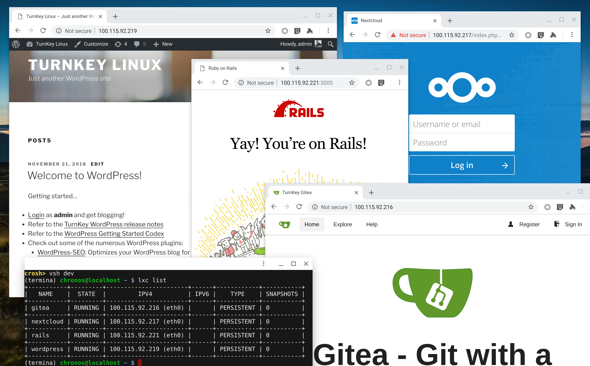

# turnkey-crostini

Run [TurnKey Linux](https://www.turnkeylinux.org/) container images in Chrome OS Crostini Linux.

TurnKey Linux offers a bunch of free and open source Debian-based pre-packaged ready-to-use server software appliances.

[turnkey-crostini](https://github.com/flenny/turnkey-crostini) uses the generic container format which is specifically packaged for [Proxmox](https://www.proxmox.com/en/). By the means of a helper container _turnkey-crostini_ creates a Crostini compatible image which gets imported and deployed to the Chrome OS _termina_ virtual machine.

## Getting started

Choose among a variety TurnKey Linux container images [here](http://mirror.turnkeylinux.org/turnkeylinux/images/proxmox/) and use the file name along with a desired container name in the command below.

e.g. `CONTAINER_NAME=rails IMAGE=debian-8-turnkey-rails_14.2-1_amd64.tar.gz`

Open crosh (press Ctrl+Alt+T anywhere in Chrome OS) and start _termina_ virtual machine `vmc start termina`.

:bulb: I do recommend using a separate _termina_ virtual machine and leave the Chrome OS _termina_/penguin instance untouched to prevent unwanted damage to the Chrome OS Crostini Linux integration. For example type `vmc start dev` to create a new VM or `vsh dev` to connect to an already existing/running VM.

```bash
CONTAINER_NAME=${container name} IMAGE=${turnkey image file name} && \
run_container.sh --container_name turnkey-helper && \
while ! (lxc exec turnkey-helper curl ifconfig.co &> /dev/null); \
do echo 'Waiting for turnkey-helper...'; sleep 1; done && \
lxc exec turnkey-helper -- sh -c \
    "curl https://raw.githubusercontent.com/flenny/turnkey-crostini/master/setup.sh > setup.sh && \
     chmod +x setup.sh && IMAGE=$IMAGE CONTAINER_NAME=$CONTAINER_NAME ./setup.sh" && \
lxc file pull turnkey-helper/root/rootfs.tar.gz /tmp && \
lxc file pull turnkey-helper/root/metadata.tar.gz /tmp && \
lxc image import /tmp/metadata.tar.gz /tmp/rootfs.tar.gz --alias turnkey-$CONTAINER_NAME && \
lxc delete --force $CONTAINER_NAME &> /dev/null; \
lxc launch turnkey-$CONTAINER_NAME $CONTAINER_NAME && \
lxc image delete turnkey-$CONTAINER_NAME &> /dev/null && \
lxc delete --force turnkey-helper && \
lxc exec $CONTAINER_NAME turnkey-init
```

:warning: Please note that an already existing container with the same name gets automatically deleted by the script. Otherwise the new container cannot be deployed.

## FAQ
* What is the default root password?\
_Type `lxc exec ${container name} passwd` to set a password for root._

* How can I connect to the TurnKey container?\
_Type `lxc exec ${container name} bash` or navigate to the containers IP address to use a web-based shell. Type `lxc list` in termina to get container IP addresses._

* I missed the TurnKey Linux first boot configuration. How can I run the script manually?\
_Type `lxc exec ${container name} turnkey-init`._

## Screenshot


